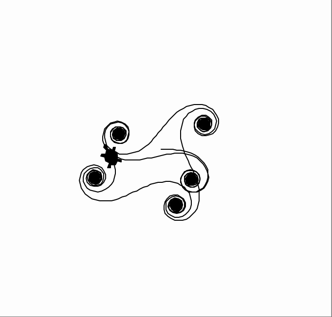

## Assignment 4 - Turtle Curves

### This assignment is based off of Coding Cassowary's video about [Euler Spirals](https://www.youtube.com/watch?v=Dpw1EF2dA74). 

The spirals looked really elegant and were very simple to code. I decided to randomize the angle size and you could really see the differences if let the turtle run for a very long time.

One experiment that I would like to look into for future projects is to set the display rates to be even quicker. The video does this through themes, but I wonder if there is a way even to set it manaully. That way, you don't have to wait for a long time to see the end results of long turtle projects.

