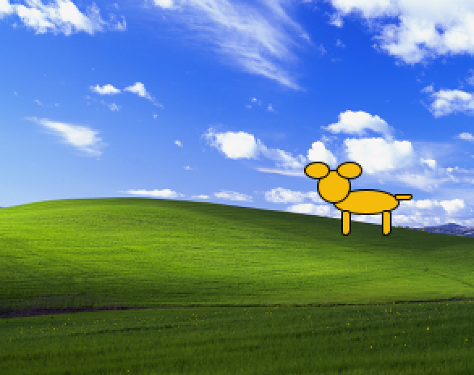
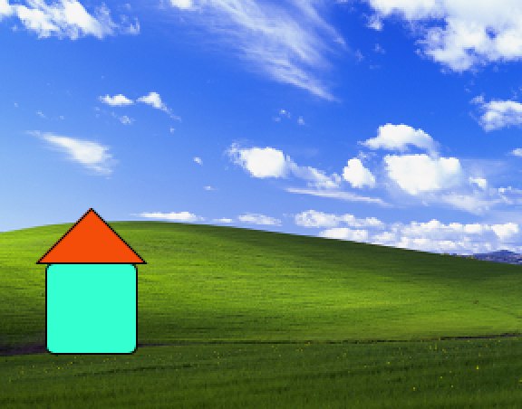

# House or Dog - A Moment of "Bliss"

## Assignment 2 - David Marquez

For this week, I was able set the background image (Bliss, Windows XP) from the web. Then I created grouped shapes named "house" and "dog" which would randomly be drawn. The dog was drawn the most for me. Let me know which shape your setup favored!

The radomized dog image looks like this:

The randomized house image looks like this:
