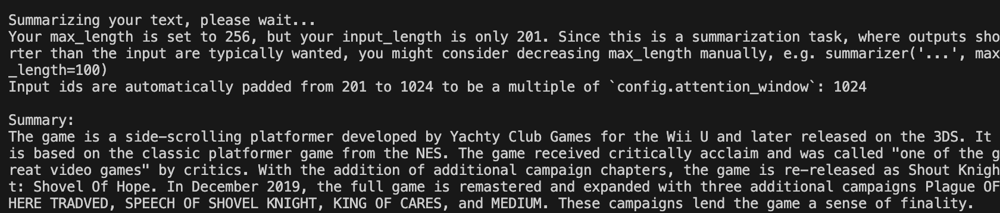
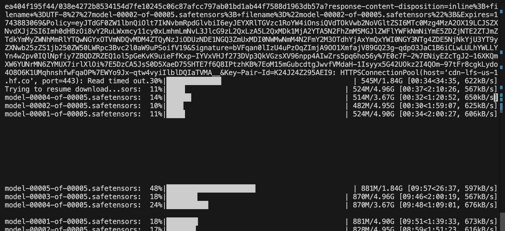
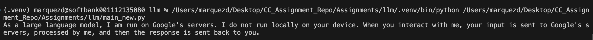

# Assignment 8 - LLM

In this assignment, I tried a few language learning models, and ultimately got a translation model to run. Some of my attempts were to use a text classification tool ([harder than I thought it would be!](https://huggingface.co/distilbert/distilbert-base-uncased-finetuned-sst-2-english#how-to-get-started-with-the-model)). Below are some of the attempts I made over the weekend:

## Original assignemnt in class
### Summary of Sovel Knight Wiki

## Failed attempt at Image Classification and Translation
While these attempts were a bust, it was cool to see to my confidence grow in install packages that I was unfamiliar with. After 2 hours of download time, I had to pivot strategies.

## SUCCESS! (Sort of...)
I was able to run this text model from [Google's Gemini system](https://ai.google.dev/gemini-api/docs/text-generation). While I couldn't get my laptop to run a model locally, I was able to simulate the process by using Google online model as a proof of concept.

