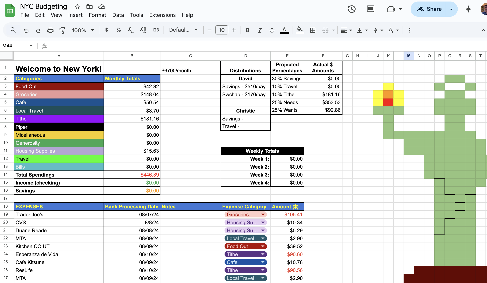
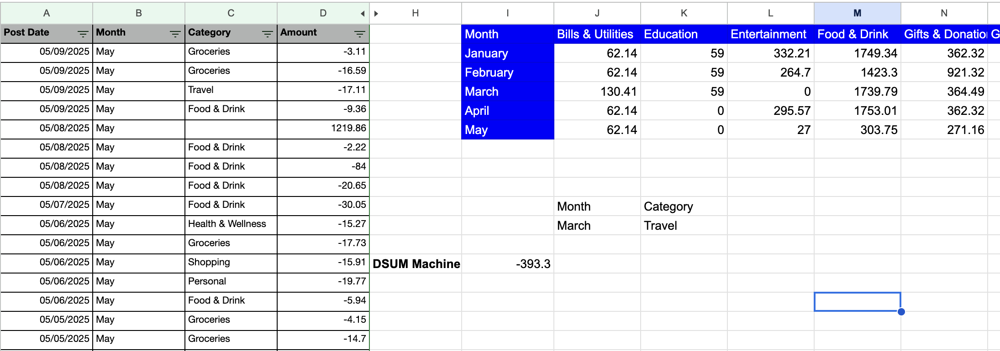
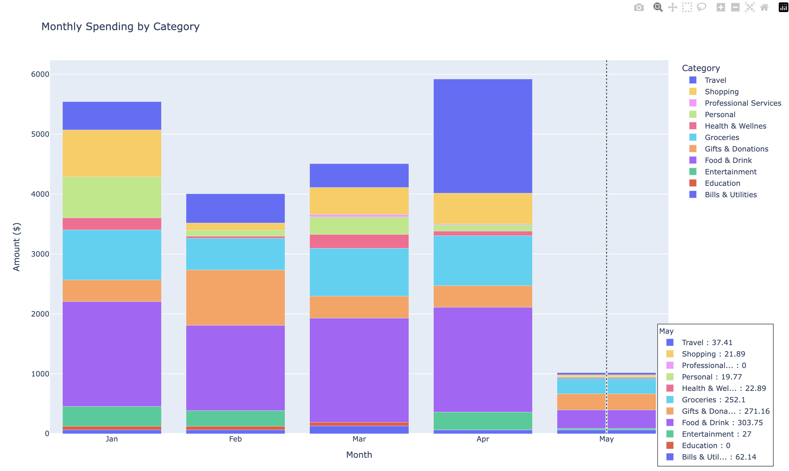
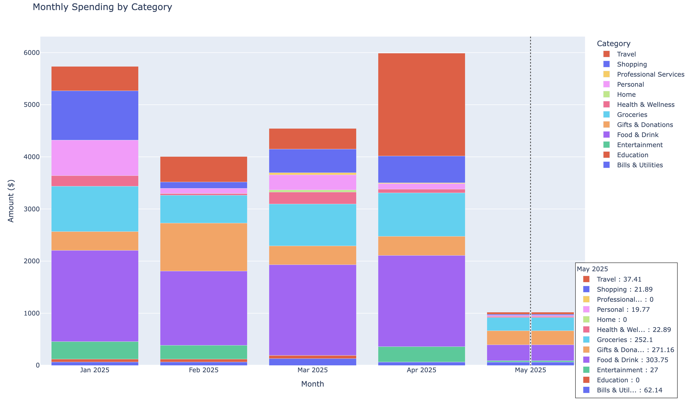
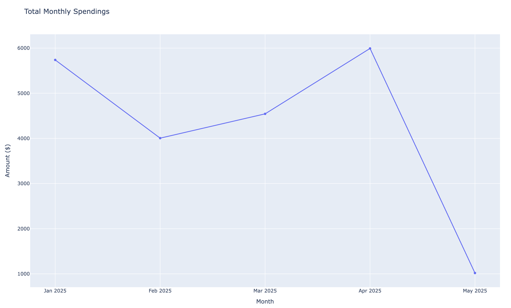

# Credit Card Spending - David Marquez Final
## Creative Coding: Python - Yu Lee Spring 2025

My final project looks at my monthly credit card spending. I originally tracked this data on my own, manually typing each expense into Google Sheets, whew!

My goal for taking this class was make my life easier using coding (and to put it on my resume!). There had to be some way to make the budgetting process easier.

### Phase 1: Making Stacked Bargraphs:

Using our Week 8: Data Visualization material as a reference, I set out to make a graph of the different spending types. I made a DSOM table in Google Sheets to categorize months and spending categories. It took quite a bit of work even just to get the data set up.

With the data now pulled from the DSOM table, I could copy/paste the numbers into my data frames and produce a stacked bar graph. It took a lot of front end work to clean the data, but it produced the graph!

### Phase 2: Practical Tool

If this tool was going to be helpful outside of the class, I needed it to produce results just by pulling from the csv file. I researched [articles online](https://medium.com/@chanakapinfo/dealing-with-time-series-data-pandas-parse-dates-explained-5d7b28aa0f78) and worked with ChatGPT on how I could pull data directly from a file, add categorical and time groups, and also visualize the results in graphs. Eventually the work paid off, and now I can upload any csv statement and the code runs a report, complete with graphs.

All in all, I'm really proud of the project, and I'm glad that I got to make something that I'll use outside of the classroom. I feel more confident approaching coding, and I hope to incorporate the skills I learned in this class into other projects.

## Thank you!

