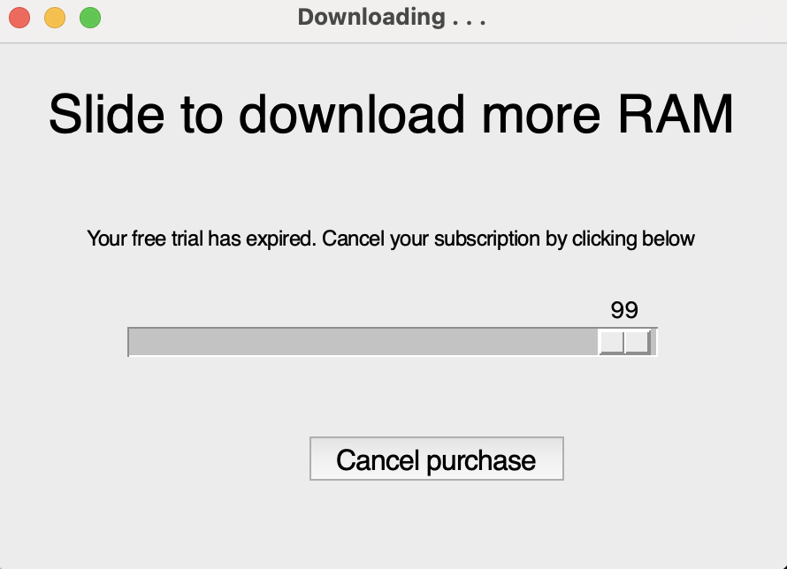

# Silly GUI Assignment

## I combined a few techniques from the other gui examples like the button, slider, random positioning, and if statements in my "downloadable RAM". Enjoy!

My code is listed in the "free_ram.py" file.

