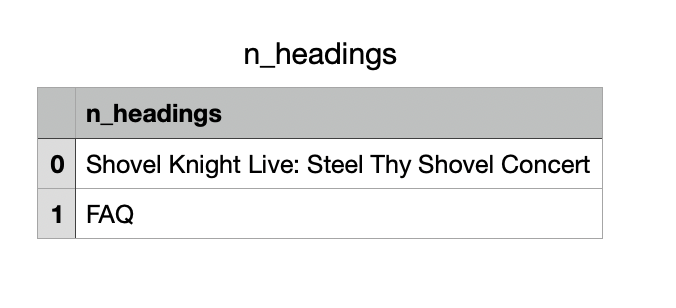
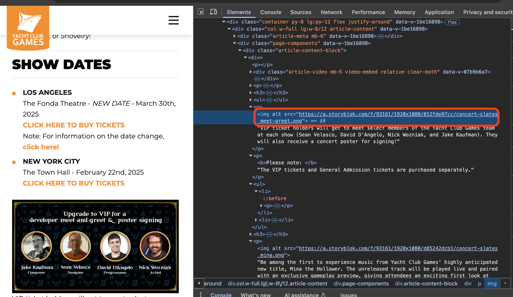

### Web Scrape Shovel Knight Concert

This week's assignment, I tried to scrape from a few gaming websites and I ultimately found a small success with the Shovel Knight: Steel Thy Concert webpage.

I was able to scrape the header and footer of the page, but I ran into issues when trying to scrape the images. The images already have full ULs so I had to practice enumerating without appending the "https" preffix. While I wasn't able to adjust or # the code to get my desired end result, I'm hoping to learn how before the end of the class.

Succesful Heading Code: nintendo_scrape.py

Successful CSV: n_headings.csv

Failed Image Code: schovel_scrape.py

