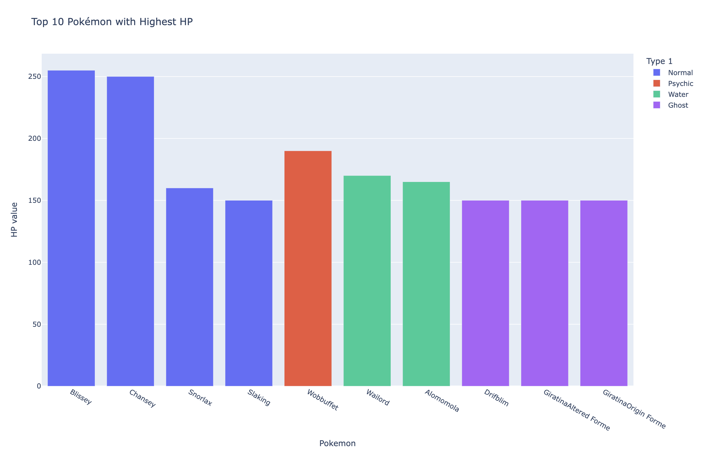
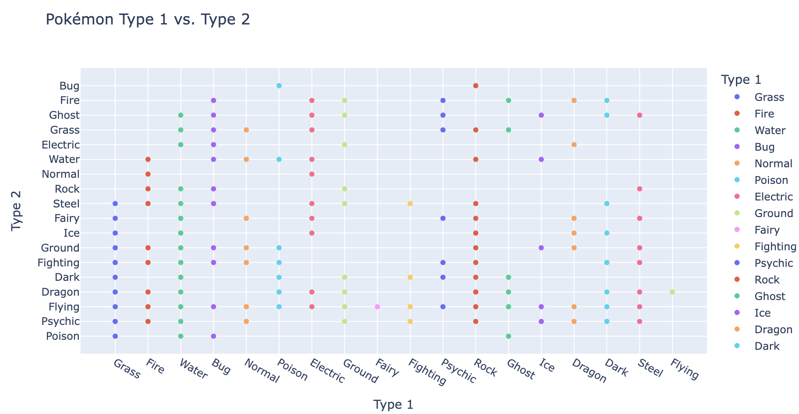

# Week 8 Assignment

### For this assignment I worked with the pokemon.csv file since I am familiar with the source material.

I started with the question which Pokemon has the highest HP? I used the main1.py file to document the code.

Seeing that almost half of the top 10 HP Pokemon were Normal Type, I wanted to see if they ranked highest in other categories. One of the class examples showed that Normal Type Pokemon were the 2nd most unique category. Maybe the trend might follow if we compared both type classifications together? See main2.py for code

I got this funny looking scatter plot with distinct grids. It seems that normal type wasn't as common with Pokemon that had two types. Rock Type was the most common Type 1 and Flying was the most common Type 2 in dual type Pokemon.